# OpenBible

Offline-first Android Bible study app. Zero telemetry. No accounts. No ads.

Kotlin + Jetpack Compose + Material 3. API 29+.

## Features

- **Bible Reader** — KJV, WEB, ASV, YLT bundled. BBE + NKJV import on first launch. Split-pane (10"+). Page flip animation (7"+). Interlinear Strong's numbers. Cross-references inline.
- **Search** — Full-text across all translations. Strong's concordance search.
- **Study Tools** — Strong's Greek/Hebrew definitions, verse-linked bottom sheet. Bible geography with coordinates. Cross-references (Treasury of Scripture Knowledge).
- **Personalization** — Bookmarks with tags. 5-color highlights. Reading history with resume. Dark/Light/Sepia themes. Font size controls (verse numbers + text).
- **Daily Use** — Daily verse notification. Home screen widget (Glance). Reading plans (365-day). Text-to-speech per chapter.
- **Notes** — Text, ink (Canvas), image, or all three. Notebooks. Auto verse linking via `Book Chap:Verse` detection. Split-screen Bible + Notes editor.
- **Retro Pixel Theme** — 7"+ tablets get a pixelated Bible UI (aged parchment, ornamental borders, pixel font).

## Screenshots

| | |
|---|---|
| 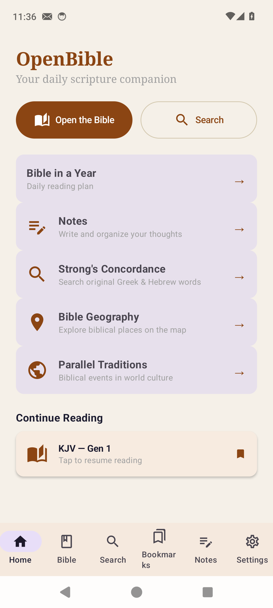 | 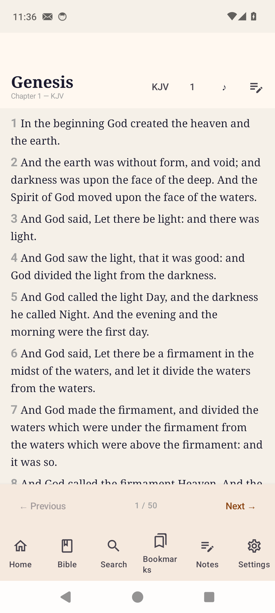 |
| 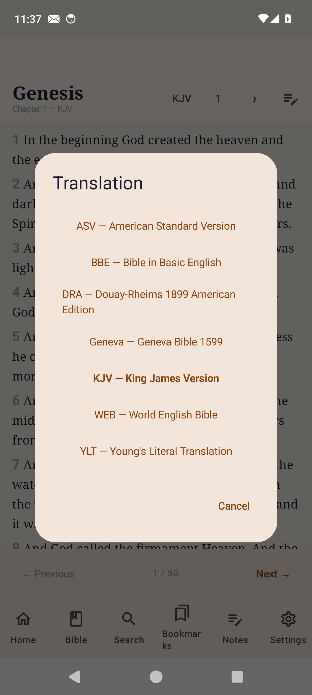 | 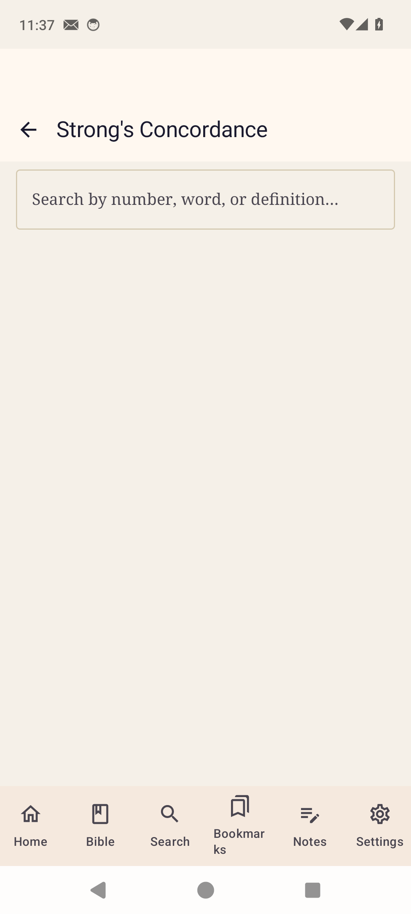 |
| 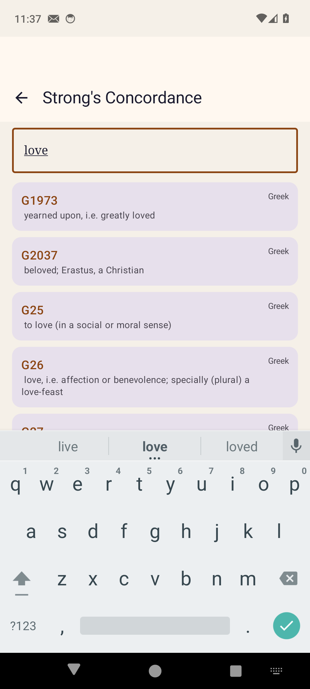 | 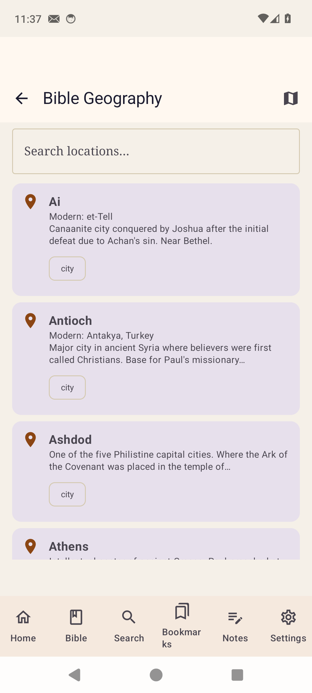 |
| 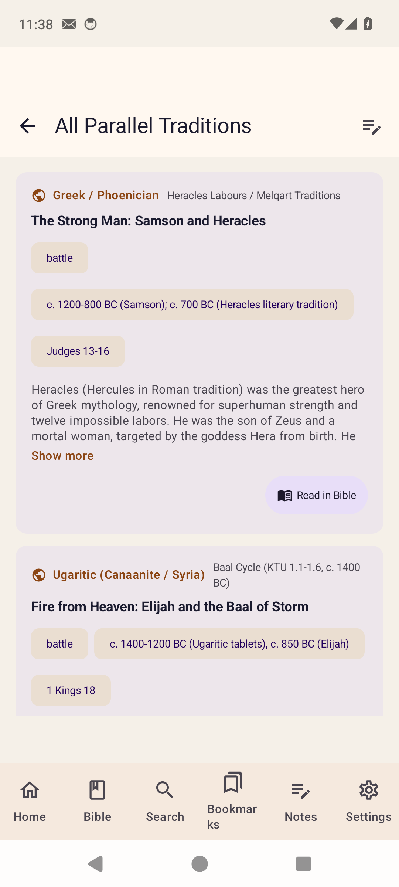 | 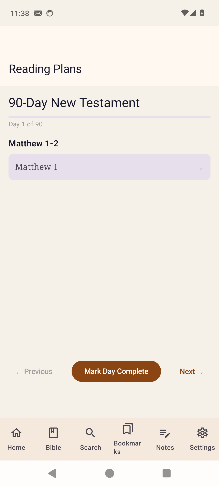 |
| 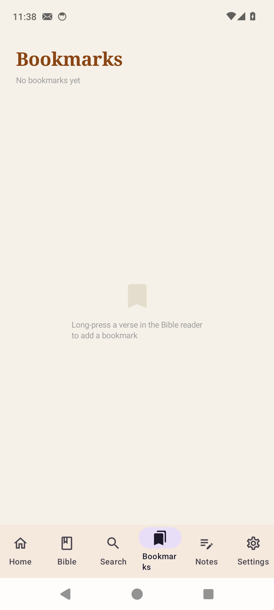 | 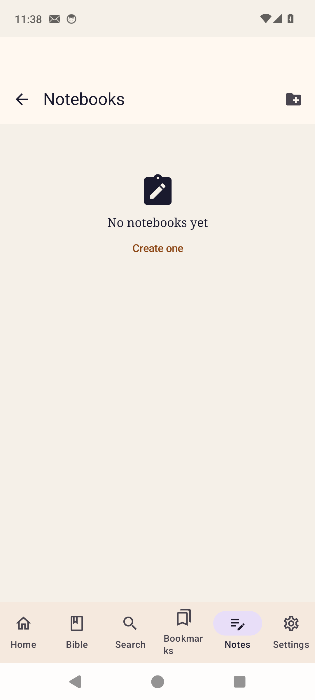 |
| 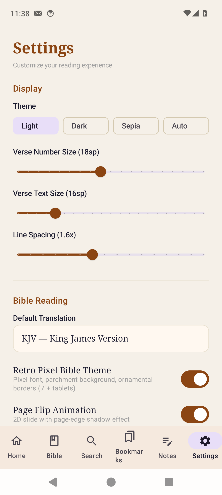 | 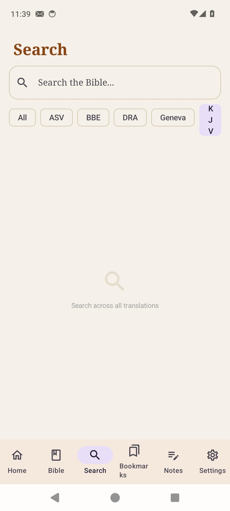 |

> **Search** uses SQLite FTS5 (standard on Android since API 24). The screenshot above shows the search entry UI; full-text results require an FTS5-capable device/emulator.

## Build

```shell
./gradlew assembleDebug
```

APK at `app/build/outputs/apk/debug/app-debug.apk` (~74MB)

### Dependencies

- Room (DB) + Hilt (DI) + DataStore (prefs)
- Compose BOM + Material 3 + Navigation
- Glance (widget) + TTS (platform)
- org.json (import parsing) + MockK / Turbine (test)

## Tests

```shell
./gradlew test
```

58 unit tests across 3 test classes:

| File | Count | What |
|------|-------|------|
| `EntitiesAndEnumsTest.kt` | 31 | 18 entities, enums, type converters |
| `DataLayerTest.kt` | 15 | ReadingPlanSeeder, InkStroke JSON, import patterns, NoteEntity |
| `ViewModelTest.kt` | 12 | HomeViewModel, StrongViewModel (MockK) |

### Test approach

- JVM unit tests only (no emulator needed)
- `org.json:json` as test dependency — shadows Android stub with real library for JSON manipulation
- `kotlinx-coroutines-test` + `StandardTestDispatcher` for viewModelScope coroutines
- MockK for DAO mocking in ViewModel tests
- Entity constructor tests verify all 18 Room entities compile and serialize

## Architecture

```
UI Layer          → Compose Screens → ViewModels → StateFlow
Data Layer        → Room DB + DataStore + JSON importers
                   Note: 18 entities, 9 DAOs, v5 schema
Storage           → SQLite (prepopulated) + local files (note images)
Network           → None. Fully offline.
```

## Data

- Bible text: KJV + WEB + ASV + YLT (~93,286 verses) preloaded in prepopulated SQLite DB
- Strong's Concordance: ~5,600 Greek + ~8,600 Hebrew entries + ~560K verse links from JSON assets
- Bible Geography: ~500 locations with coordinates + ~30K verse links
- Import scripts: Python (`data/import_bible.py`) fetches from scrollmapper

## Privacy

- **Zero telemetry**. No analytics SDK. No crash reporting.
- **No accounts**. No sign-in. No cloud sync (sync architecture is ready but opt-in only).
- **Offline-first**. All data is local. No network permission needed after initial install.
- **No ads**. Free. GPL-3.0.

## Project Status

All 6 development phases complete. 58 tests passing. Phase 6 (Polish & Ship) in progress.

See [PROJECT_REGISTRY.md](PROJECT_REGISTRY.md) for full work plan and [OPENSOURCE_HANDOFF.md](OPENSOURCE_HANDOFF.md) for production handoff.

## License

GPL-3.0. Bible translations have their own licenses (see Translation Licensing Matrix in PROJECT_REGISTRY.md). Public domain texts (KJV, WEB, ASV, YLT, BBE) are freely redistributable. NKJV is included for import only — © Thomas Nelson.
